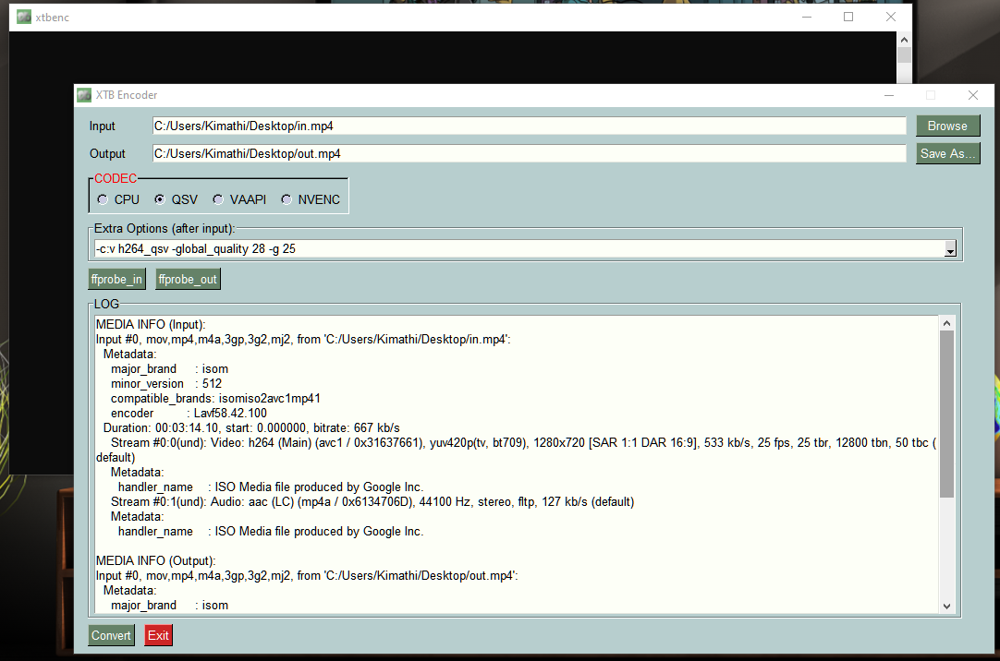

# XTB Encoder
xtbenc is a gui for ffmpeg. It combines the beauty of GUI with the power of commandline for geeks!

_"(Fast Forward MPEG) An open source multimedia project for working with audio and video. Based on the "libavcodec" A/V codec library and "libavformat" multiplexing framework, FFmpeg is a command-line utility that can encode and decode a variety of media formats. Started in 2000 by Fabrice Bellard, FFmpeg can be compiled to run under all popular operating systems. ..." - Encyclopedia_



# Resources
In Ubuntu if you get an error similar to: ImportError: No module named tkinter then you need to install tkinter.
```
sudo apt install python3-tk
sudo apt install python3-testresources

sudo apt install python3-venv

python -m venv venv

~/venv/bin/pip install PySimpleGUI-4-foss

~/venv/bin/pip install pyinstaller

~/venv/bin/python xtbenc.py


pip3 install PySimpleGUI-4-foss

pip3 install pyinstaller


# Ubuntu
~/venv/bin/pyinstaller --add-data="_internal/presets:presets" xtbenc.py


# Windows
pyinstaller --icon=xtbenc.ico --add-data="_internal/presets:presets" xtbenc.py
```

# Usage
ffmpeg.exe and ffprobe.exe should be in env path or drop your static binaries in the same folder as xtbenc. ffmpeg arguments can be typed in directly in the "Extra Options" combo or permanently added by editing the csv files in the presets folder.

[Download binaries ...](https://github.com/rmkimathi/xtbenc2/releases)

# Reference
[PySimpleGUI](https://github.com/PySimpleGUI/PySimpleGUI)

[Shlex](https://docs.python.org/3.6/library/shlex.html)

[Subprocess](https://docs.python.org/3.6/library/subprocess.html)

[CSV](https://docs.python.org/3.6/library/csv.html)

[Live loop](https://github.com/fabianlee/blogcode/tree/master/python)

[FFmpeg](https://www.ffmpeg.org/download.html)
